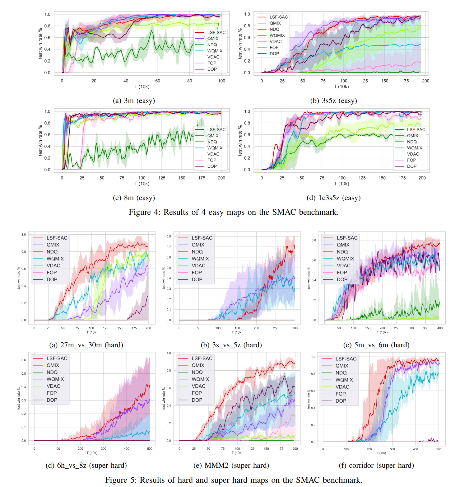

# LSF-SAC

Pytorch implementations of the paper [Value Functions Factorization with Latent State Information Sharing in Decentralized  Multi-Agent Policy Gradients](https://arxiv.org/abs/2201.01247) and several other multi-agent reinforcement learning algorithms, including 
[IQL](https://arxiv.org/abs/1511.08779),
[QMIX](https://arxiv.org/abs/1803.11485), [VDN](https://arxiv.org/abs/1706.05296), 
[COMA](https://arxiv.org/abs/1705.08926), [QTRAN](https://arxiv.org/abs/1905.05408)(both **QTRAN-base** and **QTRAN-alt**),
[MAVEN](https://arxiv.org/abs/1910.07483), [CommNet](https://arxiv.org/abs/1605.07736), 
[DyMA-CL](https://arxiv.org/abs/1909.02790?context=cs.MA), and [G2ANet](https://arxiv.org/abs/1911.10715), 
which are the state of the art MARL algorithms. The paper implementation and other algorithms' implementation is based on [starry-sky6688's qmix impplementation](https://github.com/starry-sky6688/StarCraft).

## Requirements

- python
- torch
- [SMAC](https://github.com/oxwhirl/smac)
- [pysc2](https://github.com/deepmind/pysc2)

## Acknowledgement

+ [SMAC](https://github.com/oxwhirl/smac)
+ [pymarl](https://github.com/oxwhirl/pymarl)
+ [QMIX Impplementation](https://github.com/starry-sky6688/StarCraft)


## Quick Start
```shell
$ python main.py --map=3m
```

Directly run the `main.py`, then the algorithm will start **training** on map `3m`. **Note** CommNet and G2ANet need an external training algorithm, so the name of them are like `reinforce+commnet` or `central_v+g2anet`, all the algorithms we provide are written in `./common/arguments.py`.

If you just want to use this project for demonstration, you should set `--evaluate=True --load_model=True`. 

The running of DyMA-CL is independent from others because it requires different environment settings, so we put it on another project. For more details, please read [DyMA-CL documentation](https://github.com/starry-sky6688/DyMA-CL).

## Result

We independently train these algorithms for 8 times and take the mean of the 8 independent results, and we evaluate them for 20 episodes every 100 training steps. All of the results are saved in  `./result`.
Results on other maps are still in training, we will update them later.

### 1. Mean Win Rate of 8 Independent Runs with `--difficulty=7(VeryHard)`
<div align=center></div>


## Replay

Check the website for several replay examples
[here](https://sites.google.com/view/sacmm)

If you want to see the replay from your own run, make sure the `replay_dir` is an absolute path, which can be set in `./common/arguments.py`. Then the replays of each evaluation will be saved, you can find them in your path.

## Citation

If you find this helpful to your research, please consider citing this paper as
```
@misc{zhou2022value,
      title={Value Functions Factorization with Latent State Information Sharing in Decentralized Multi-Agent Policy Gradients}, 
      author={Hanhan Zhou and Tian Lan and Vaneet Aggarwal},
      year={2022},
      eprint={2201.01247},
      archivePrefix={arXiv},
      primaryClass={cs.MA}
}
```
